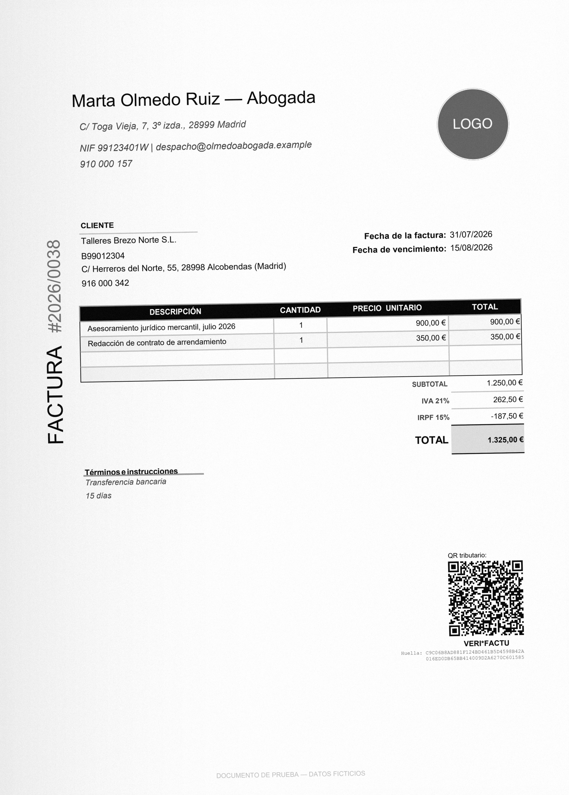
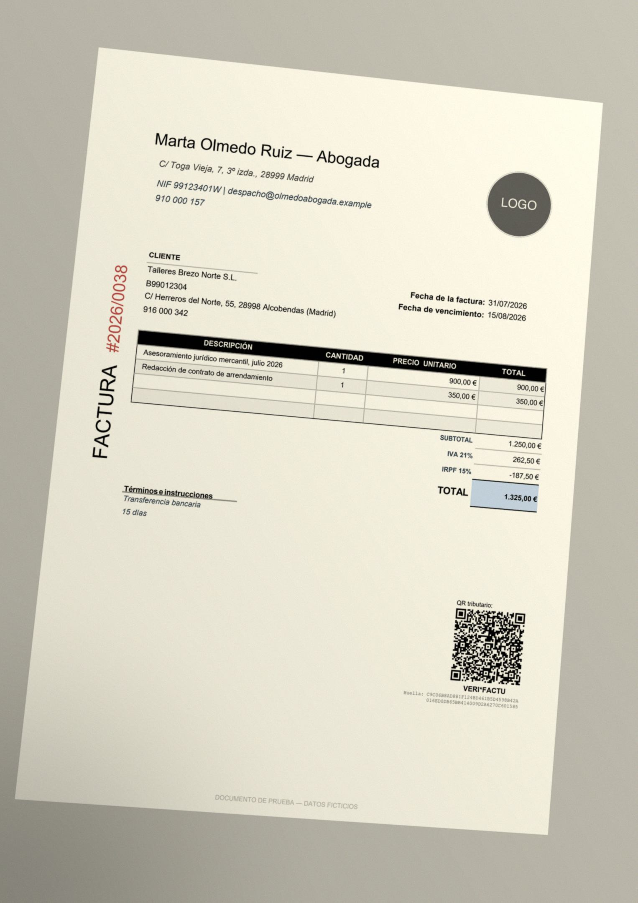
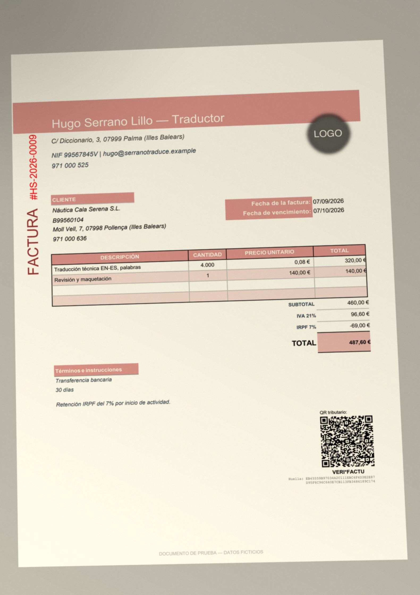

# Cazafacturas

Extrae los datos de una factura y comprueba que la factura es correcta.
En tu máquina. **Sin IA, sin red y sin claves de API.**

Sueltas PDF y te dice cuáles no puedes contabilizar y por qué. Escaneados y
fotos también los abre, pero hoy los lee mal, y está medido: más abajo.

---

## Por qué no usa IA

Porque para esto no hace falta, y usarla cuesta tres cosas que un programa de
contabilidad no se puede permitir:

| | Con modelo | Cazafacturas |
|---|---|---|
| **Reproducibilidad** | La misma factura puede dar dos respuestas distintas | El mismo PDF da el mismo informe hoy y dentro de un año |
| **Privacidad** | El documento sale de la máquina | No hay servidor al que salir |
| **Coste** | Por documento | Cero |
| **Arranque** | Clave de API, cuenta, facturación | `pip install` y un comando |

Un NIF no se adivina: se calcula. Que la base imponible cuadre con la suma de
las líneas no es una opinión: es una resta. Todo lo que hace este programa
tiene una respuesta correcta y comprobable, así que la calcula.

## Qué comprueba

**Identificadores fiscales, con dígito de control, no con una expresión
regular.** Un identificador con formato válido y control inválido se rechaza:

- España — letra del DNI y del NIE, dígito de control del CIF (numérico o
  letra según el tipo de sociedad)
- Reino Unido — VAT de 9 cifras, módulo 97
- Alemania — USt-IdNr., módulo 11
- Estados Unidos — EIN, con la lista de prefijos que el IRS no asigna

**Aritmética, línea a línea:** `cantidad × precio = importe` · suma de líneas =
base imponible · `base × tipo = cuota` ·
`base + IVA + recargo − retención + suplidos = total`. Con dos céntimos de
tolerancia, que eso es redondeo y no un error.

**Cada concepto en su sitio.** IVA a varios tipos en la misma factura, con el
IRPF metido entre medias si hace falta; recargo de equivalencia, que suma y
va aparte del IVA; retención, que resta; suplidos, que se cobran pero no son
base ni impuesto; descuento, que se aplica sobre la base **antes** del
impuesto. Las líneas se comparan contra la base declarada: una base falsa con
el IVA y el total calculados sobre ella cuadra en todo lo demás, y es
justamente la que hay que cazar.

**Una cuota cero es un dato.** Exenta, intracomunitaria, exportación o
inversión del sujeto pasivo llevan IVA cero y es correcto; lo que no puede
pasar es declarar la exención y repercutir IVA a la vez.

**Coherencia del documento:** vencimiento posterior a la emisión, factura con
número, emisor distinto del receptor, cantidades mayores que cero, tipos de
impuesto vigentes en el país que corresponde —el 19 % es correcto en Alemania
y no existe en España—. La rectificativa va en negativo y cita la factura que
rectifica; un total negativo que no es rectificativa es un error. La
simplificada puede no identificar al destinatario, y eso no se marca.

**Y distingue «no conforme» de «no legible».** Si no ha podido leer los
importes, no afirma que la factura esté mal: dice que no la ha podido leer.
Decir «no conforme» de algo que no se ha sabido leer es el error que más
confianza destruye en una herramienta así.

**Y si no es una factura, lo dice.** Un albarán, un presupuesto o una proforma
se identifican y se rechazan con una frase, en vez de listar los quince campos
de factura que les faltan.

## Cuánto acierta, y qué significa esa cifra

Hay dos bancos de pruebas, y miden cosas distintas.

**El banco externo es el que cuenta.** 23 facturas en PDF de **15
maquetaciones de terceros** —plantillas reales de otros, rellenadas con datos
ficticios y fiscalmente correctos—, con la respuesta escrita de antemano en
[`dataset/externo/manifest.json`](dataset/externo/manifest.json). Quince deben
salir conformes; ocho traen un defecto deliberado y deben caer, cada una por
su motivo y sin arrastrar ningún otro error.

| | |
|---|---|
| Campos bien leídos: número, fecha, emisor, NIF, base, cuota, IRPF, recargo, suplidos, total | 153 / 153 |
| Facturas correctas que salen conformes | 15 / 15 |
| Defectuosas que caen por su motivo, y solo por él | 8 / 8 |
| Documentos que se quedan en «No legible» | 0 |

```bash
python cli.py --externo
```

Entre las quince hay IVA a dos tipos con el IRPF intercalado, recargo de
equivalencia, exenta, intracomunitaria, exportación, inversión del sujeto
pasivo, rectificativa en negativo, simplificada con el IVA dentro de los
precios, descuento global y suplidos. Entre las ocho, en cuatro el resto de la
aritmética es coherente con el dato falso: no caen por un descuadre general,
caen porque las líneas se comprueban contra la base.

**El banco interno** —24 facturas y 50 casos trampa en cuatro países— lo
genera este mismo repositorio, con **una sola maquetación**. Sirve para
detectar regresiones y para eso está la línea base. Antes, aquí ponía «100 %
de precisión campo a campo» sacado de ese banco. **Esa cifra no valía:** el
primer pase contra el banco externo marcó como no conformes las quince
facturas buenas. El extractor estaba ajustado a su propia plantilla, cogía el
título «FACTURA» como emisor y no reconocía «IVA21%» como cuota. Se ha
retirado.

### La letra pequeña, que importa más que la cifra

**El 153 de 153 también se ha conseguido con esas facturas delante.** El
extractor se ha corregido mirando el banco externo, así que es un conjunto de
desarrollo, no uno reservado. Demuestra que lee quince maquetaciones que no
hizo él —mucho más que antes—; no demuestra que lea la decimosexta. La
próxima medida honrada es contra facturas que el código no haya visto nunca.

**El OCR está medido, y suspende.** Sobre las versiones escaneada y
fotografiada de esas mismas 23 facturas —las que genera el degradador que se
describe abajo—, con el mismo extractor que acierta 153 de 153 en PDF:

| | Escaneado | Foto |
|---|---|---|
| Campos bien leídos | 45 / 153 | 66 / 153 |
| Facturas con el veredicto correcto | 0 / 23 | 0 / 23 |
| Tiempo por imagen | 20 a 60 s | 17 a 52 s |

En imagen no reconoce nunca la tabla de líneas ni el número de factura, y casi
nunca la fecha. Todavía no he analizado por qué, y no voy a adelantar una
causa sin haberla medido. Lo que sí hace bien es no mentir: la mayoría sale
«No legible» y no «No conforme». Arreglarlo es el trabajo siguiente, y ya hay
con qué medirlo.

**Las cuatro jurisdicciones no están al mismo nivel.** España está modelada en
serio: DNI, NIE, CIF con su dígito de control según el tipo de sociedad,
tipos de IVA y de recargo vigentes, retención de IRPF, exenciones. Reino Unido
y Alemania llevan la comprobación del identificador —módulo 97 y módulo 11— y
sus tipos de IVA. Estados Unidos solo valida el EIN: el *sales tax* varía por
estado y aquí no se comprueba.

**Dos cosas del propio banco externo.** Tres números de factura del manifest
(f05, f12 y f21) estaban leídos al revés: van en un rótulo vertical que se lee
de abajo arriba —es «2026/0038», no «8300/6202»—. Está comprobado sobre la
imagen de la página y el manifest del repositorio lleva la corrección. Y los
NIF-IVA extranjeros del banco (FR83999123456, GB999000111) no superan el
dígito de control de su país: de un identificador extranjero se comprueba el
formato, y el informe lo dice así en vez de fingir más.

Lo pongo por delante porque un revisor con oficio lo ve en treinta segundos,
y prefiero decirlo yo.

### Las mismas facturas, escaneadas y fotografiadas

[`dataset/degradar.py`](dataset/degradar.py) convierte cada PDF del banco
externo en un escaneo de oficina —300 ppp en gris, torcido, con ruido y un
borde oscurecido— y en una foto de móvil sobre una mesa: perspectiva, luz de
ventana, sombra en una esquina, JPEG. Hay tres niveles de dureza.

<p>



</p>

Es determinista byte a byte: la semilla sale del nombre de la factura, las
versiones que deciden el píxel están fijadas en
[`dataset/requirements-degradar.txt`](dataset/requirements-degradar.txt), y lo
que se aplicó a cada factura queda en
[`dataset/externo/degradacion.json`](dataset/externo/degradacion.json). Por eso
las imágenes no van en el repositorio —los PNG pesan unos 5 MB, y es el ruido,
que sin pérdida no se comprime—: se regeneran idénticas.

```bash
python -m dataset.degradar
```

## Instalación

Clona y ejecuta el instalador. Monta un entorno propio en `.venv`, así que no
toca el Python del sistema ni le cambia versiones a nada que ya tengas.

**Windows**

```powershell
powershell -ExecutionPolicy Bypass -File instalar.ps1
```

**macOS y Linux**

```bash
sh instalar.sh
```

El instalador comprueba la versión de Python, monta el entorno, instala,
genera las 74 facturas de muestra, **pasa el diagnóstico** y deja un
lanzador. Se puede volver a ejecutar las veces que haga falta.

Después:

```bash
./cazafacturas
```

En Windows, doble clic en `Cazafacturas.cmd`. Abre el navegador solo.

<details>
<summary>A mano, sin instalador</summary>

```bash
python -m venv .venv
.venv/bin/pip install -e ".[ocr,muestras]"
.venv/bin/python -m dataset.render_pdf
.venv/bin/cazafacturas
```

`[ocr]` añade la lectura de escaneados y fotos; son modelos que vienen dentro
del paquete, **no hace falta Tesseract ni ningún binario del sistema**.
`[muestras]` genera las facturas de ejemplo. Sin los extras, la aplicación
funciona con PDF que llevan capa de texto y lo dice en pantalla.

`requirements.lock` tiene las versiones exactas con las que se midió la línea
base, por si hace falta reproducir una medida vieja.

</details>

Requiere Python 3.10 o superior. La raíz es la presentación; la aplicación
está en `/app`.

## Comprobar que sigue bien

```bash
python cli.py --doctor
```

Revisa la instalación y **vuelve a medir el banco contra la línea base
commiteada**. Si un cambio baja la precisión, dice qué campos han empezado a
fallar; si se escapa un caso trampa, lo nombra. Después pasa el banco
externo, que no tiene línea base porque tiene que salir entero: una sola
factura mal y el diagnóstico falla. Devuelve 1 cuando algo ha
empeorado, así que sirve de puerta en integración continua y no solo para
mirarlo.

## La interfaz

El proyecto se ve como lo que hace. Al entrar hay una presentación de treinta
segundos —saltable, y que no se repite en visitas posteriores— en la que una
factura se levanta a bolígrafo sobre una hoja de talonario y se sella
**CONFORME**; después entra la hoja siguiente del mismo taco, que resulta ser
un albarán, y se sella **NO CONFORME**.

La aplicación es un libro mayor: el rayado es la maqueta y no hay una sola
tarjeta. Las cifras van tabulares y alineadas a la derecha, porque se leen
comparando columnas. Lo que no cuadra sale en rojo con un filete de un píxel
en el borde de la fila —el fondo no se tiñe nunca, que eso destroza la lectura
de una tabla—. Y un lote que cuadra cierra con **doble raya**, que en
contabilidad significa comprobado: no hay verde de éxito en ninguna parte.

Todo se dibuja en el navegador. Las texturas —el papel de plano, el grano, el
desgarro del canto, la tinta desigual del sello— son SVG y CSS, sin una sola
imagen. Las dos roturas son distintas y están medidas sobre un talonario de
verdad: la hoja de talonario va troquelada y rompe fina y regular; la del
libro mayor se rasga por el lomo, sin guía, y sale basta e irregular.

Las fuentes se sirven desde el propio repositorio. La aplicación promete
funcionar sin conexión y lo cumple hasta ahí.

## Cómo se usa

Arrastras los ficheros a la ventana. Cada documento se asienta en un renglón
del libro, con su número, su fecha, su emisor y sus importes; lo que no cuadra
sale en rojo. Pulsando en una fila se abre el detalle: el veredicto, de dónde
salió cada campo y con qué confianza, y cada comprobación incumplida con el
valor esperado al lado del encontrado.

Si no quieres enseñar tus facturas, hay **74 PDF de muestra** incluidos:
«Probar con facturas de muestra» los carga.

Formatos: `.pdf` `.png` `.jpg` `.jpeg` `.tif` `.tiff` `.bmp` `.webp`.
Idiomas: español e inglés. Jurisdicciones: España, Reino Unido, Estados Unidos
y Alemania.

## Línea de comandos

```bash
python cli.py factura.pdf otra.pdf
```

```bash
python cli.py --banco -v
```

```bash
python cli.py --externo
```

```bash
python cli.py --csv salida.csv "facturas/*.pdf"
```

`--capacidades` dice qué sabe hacer tu instalación. `--json` vuelca el
resultado crudo. `--pais ES|UK|US|DE` fuerza la jurisdicción en vez de
detectarla.

## Cómo funciona por dentro

```
fichero → lectura → extractor → validador → informe
```

| Módulo | Qué hace |
|---|---|
| [`lectura.py`](backend/nucleo/lectura.py) | PDF con capa de texto vía `pdfplumber`; escaneado se rasteriza y va a OCR local; imagen directa a OCR. Devuelve el texto con la posición de cada palabra. Recupera los espacios que las maquetas apretadas pierden, lee los rótulos en vertical en su sentido y, de dos capas de texto superpuestas, se queda con la que se ve. |
| [`extractor.py`](backend/nucleo/extractor.py) | Busca la etiqueta y lee lo que hay a su derecha o en la celda de debajo, en cuatro idiomas. El emisor se ancla a su NIF, no a la primera línea del papel. Los totales se leen como conceptos —IVA, IRPF, recargo, suplidos, descuento— y no como un orden fijo. Resuelve `1.234,56` y `1,234.56`, y sabe que `05/03` es 5 de marzo en España y 3 de mayo en Estados Unidos. |
| [`validador.py`](backend/nucleo/validador.py) | Las reglas fiscales. No lanza excepciones: una factura con errores es el caso interesante, así que cada regla incumplida sale como un hallazgo con su explicación. |
| [`analizador.py`](backend/nucleo/analizador.py) | Orquesta la cadena, decide el estado —conforme, con avisos, no conforme, no legible— y, cuando hay respuesta correcta conocida, puntúa. |
| [`banco_externo.py`](backend/nucleo/banco_externo.py) | Pasa las 23 facturas externas y las contrasta con su manifest, campo a campo y veredicto a veredicto. |

Cada campo extraído lleva su confianza y la pista que lo produjo —qué etiqueta
lo encontró—, para que puedas desconfiar con fundamento.

**Los documentos no salen de tu ordenador.** No hay telemetría, no hay
llamadas externas, ni siquiera para las fuentes: están dentro del repositorio.

## Desarrollo

```bash
pip install -e ".[dev]"
```

```bash
pytest
```

125 tests, en cinco familias:

| | |
|---|---|
| Banco externo | las 23 facturas de terceros: cada campo, cada veredicto, y cada defectuosa por su motivo |
| Reglas fiscales | cada regla con su caso, y el dataset entero como red |
| Extracción | campo a campo contra el esperado, sobre PDF y no sobre diccionarios |
| Seguridad | cada test reproduce el ataque que la defensa evita |
| Propiedades | Hypothesis busca el contraejemplo en el parser de importes, el de fechas y los dígitos de control |

Regenerar el dataset y sus PDF:

```bash
python -m dataset.generador && python -m dataset.generar_trampas && python -m dataset.render_pdf
```

Los generadores son deterministas —semillas 42 y 7—, así que el dataset
regenerado es idéntico. Los identificadores fiscales son inventados pero
**válidos**: el dígito de control se calcula. Si no, el propio validador
rechazaría su dataset.

## Lo que no hace

No contabiliza, no concilia, no presenta impuestos y no emite facturas.

No comprueba si un NIF existe en el censo de Hacienda: comprueba que su dígito
de control es coherente. Son cosas distintas y el programa no las confunde.

No detecta fraude ni falsificación.

## Autoría

Hecho por [LatidosIA.com](https://latidosia.com).

## Licencia

MIT.
